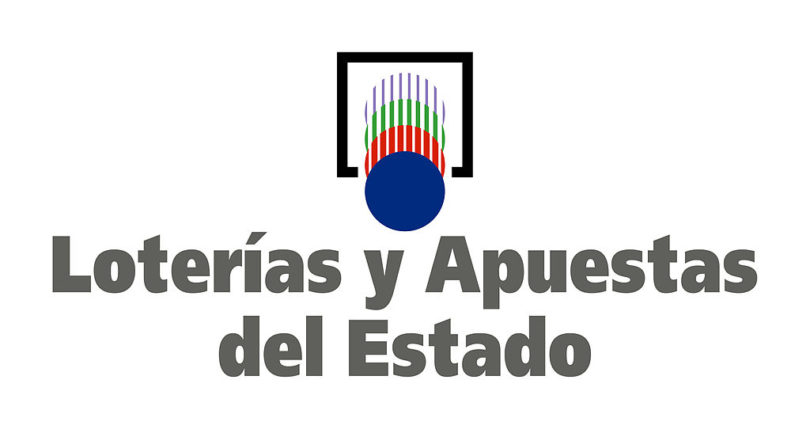

### README in English 🇬🇧 ➡️ [Link](./README.md)

# Generador de Números de Lotería Española 🎰

Una aplicación Python diseñada para generar números de lotería aleatorios para los juegos de Eurodreams, Bonoloto y Euromillones. Utilizando la biblioteca Typer para la interfaz de línea de comandos (CLI) y la biblioteca Trogon para mejoras de la interfaz de usuario terminal (TUI), esta herramienta ofrece una forma divertida e interactiva de jugar tus loterías favoritas. 🚀



## Demo


## Características

- **CLI Interactivo**: Genera números de lotería directamente desde la línea de comandos. 💻
- **Mejoras de TUI**: Disfruta de una experiencia de terminal mejorada con títulos de arte ASCII para cada juego. 🖼️
- **Generación de Números Aleatorios**: Genera números aleatorios únicos para Eurodreams, Bonoloto y Euromillones de acuerdo con las reglas oficiales. 🔢

## Empezando

### Requisitos previos

- Python 3.6+
- Biblioteca Typer
- Biblioteca Trogon
- Activos para arte ASCII (incluidos en el proyecto)

### Instalación

Clona el repositorio e instala las bibliotecas requeridas:

```bash
git clone https://github.com/GeroZayas/Spanish-Lottery-CLI.git
cd Spanish-Lottery-CLI
pip install -r requirements.txt
```

### Uso

Ejecuta la aplicación desde la línea de comandos:

```bash
python3 lottery.py [OPTIONS] COMMAND
```

Esto iniciará la CLI donde puedes seleccionar el juego de lotería que deseas jugar:

- Escribe `eurodreams` para generar números para Eurodreams.
- Escribe `bonoloto` para generar números para Bonoloto.
- Escribe `euromillones` para generar números para Euromillones.

Cada comando mostrará los números generados en una cadena formateada, junto con un título de arte ASCII para el juego.

## Contribución

Las contribuciones son bienvenidas. Siéntete libre de enviar un pull request o abrir un issue para sugerir mejoras o reportar errores. 🛠️

## Licencia

Este proyecto está licenciado bajo la Licencia MIT. 📝
